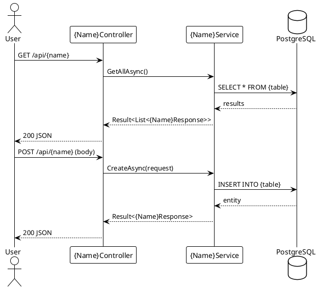
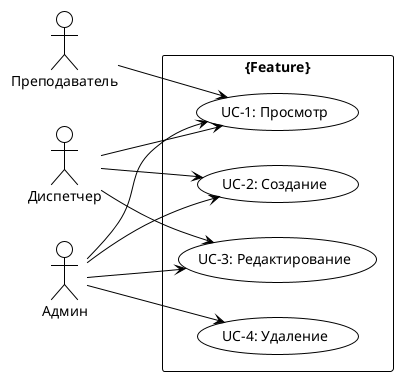

# plantuml-docs

Generate PlantUML diagrams after a feature is complete. Use either the online service or a local JAR.

## Diagram types to generate

| Type | File pattern | When |
|------|-------------|------|
| ER (Entity-Relationship) | `docs/diagrams/er/{entity}.puml` | After entity + migration |
| Class (Service Architecture) | `docs/diagrams/class/{service}.puml` | After controller + service |
| Sequence (API Flow) | `docs/diagrams/sequence/{flow}.puml` | After endpoint is tested |
| UseCase (User Stories) | `docs/diagrams/usecase/{feature}.puml` | After feature complete (optional) |
| Deployment (Architecture) | `docs/diagrams/deployment/deploy.puml` | After CI/CD setup (optional) |

## ER Diagram template

**`docs/diagrams/er/{entity}.puml`:**
```plantuml
@startuml
!theme plain

entity "{Entity}" {
  * id: GUID
  --
  * property: string
  created_at: datetime
  updated_at: datetime
}

entity "{RelatedEntity}" {
  * id: GUID
  --
  * {entity}_id: GUID (FK)
}

{Entity} ||--o{ {RelatedEntity}
@enduml
```

## Class Diagram template

**`docs/diagrams/class/{service}.puml`:**
```plantuml
@startuml
!theme plain

interface I{Name}Service {
  + GetAllAsync(ct): Result<List<{Name}Response>>
  + GetByIdAsync(id, ct): Result<{Name}Response>
  + CreateAsync(req, ct): Result<{Name}Response>
  + UpdateAsync(id, req, ct): Result<{Name}Response>
  + DeleteAsync(id, ct): Result
}

class {Name}Service {
  - db: AppDbContext
  + GetAllAsync(ct): Result<List<{Name}Response>>
  + GetByIdAsync(id, ct): Result<{Name}Response>
  + CreateAsync(req, ct): Result<{Name}Response>
  + UpdateAsync(id, req, ct): Result<{Name}Response>
  + DeleteAsync(id, ct): Result
}

class {Name}Controller {
  - service: I{Name}Service
  + GetAll(ct): ActionResult
  + GetById(id, ct): ActionResult
  + Create(req, ct): ActionResult
  + Update(id, req, ct): ActionResult
  + Delete(id, ct): ActionResult
}

I{Name}Service <|.. {Name}Service
{Name}Controller --> I{Name}Service
@enduml
```

## Sequence Diagram template

**`docs/diagrams/sequence/{flow}.puml`:**


## UseCase Diagram template

**`docs/diagrams/usecase/{feature}.puml`:**


## How to render

### Option 1: Online (no install)
1. Go to https://www.plantuml.com/plantuml/uml/
2. Paste the `.puml` content or encode the diagram
3. Download as PNG/SVG

### Option 2: Local PlantUML JAR
```powershell
# Download PlantUML
Invoke-WebRequest -Uri "https://github.com/plantuml/plantuml/releases/latest/download/plantuml.jar" -OutFile "plantuml.jar"

# Render all diagrams
java -jar plantuml.jar docs/diagrams/**/*.puml

# Render with specific output format
java -jar plantuml.jar -tsvg docs/diagrams/er/*.puml
```

### Option 3: VS Code extension
Install "PlantUML" extension → right-click `.puml` → "Preview"

## Convention rules

- Save `.puml` files in version control alongside code
- Generated images (PNG/SVG) in `.gitignore`
- One `.puml` file per diagram
- Include `!theme plain` for clean monochrome look
- Use Russian labels for actors and use cases
- Use English for class/entity/field names (matches code)

## Verification

- `.puml` files render without syntax errors
- ER diagram matches actual entity fields
- Sequence diagram matches actual API flow
- Class diagram matches actual service/controller structure
