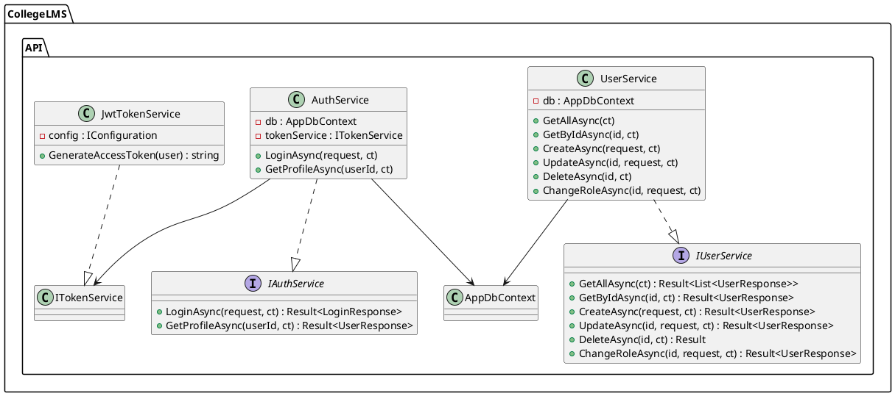
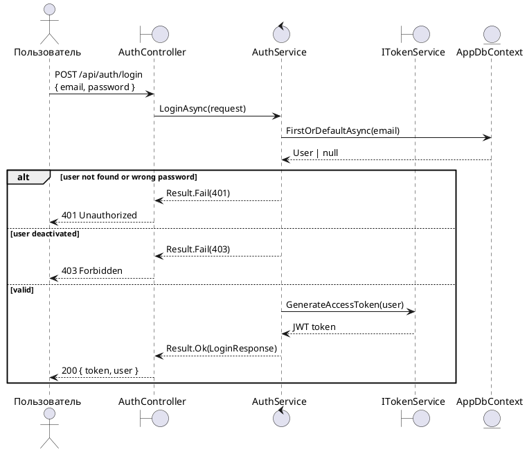
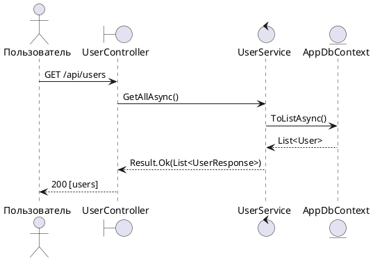

# Auth Redesign Implementation Plan

> **For agentic workers:** REQUIRED SUB-SKILL: Use superpowers:subagent-driven-development (recommended) or superpowers:executing-plans to implement this plan task-by-task. Steps use checkbox (`- [ ]`) syntax for tracking.

**Goal:** Полная переработка Auth feature с нуля с использованием новых скиллов (design-system, aspnet-core, TDD, Playwright, PlantUML, security-threat-model)

**Architecture:** Monolith, Clean Architecture, Result<T> pattern, ASP.NET Core Web API + Next.js 14 + shadcn/ui

**Tech Stack:** .NET 10, EF Core + Npgsql, JWT, BCrypt, FluentValidation, Swashbuckle, xUnit + Moq + Bogus, Next.js 14, Tailwind CSS v4, shadcn/ui, Playwright

## Global Constraints
- All entities inherit from `Entity` base (Id, CreatedAt, UpdatedAt)
- GUID PKs with `ValueGeneratedNever()`
- All string props: `HasMaxLength()` required
- Enum props: `HasConversion<string>()` + `HasMaxLength()` required
- `Result<T>.Ok()` / `Result<T>.Fail()` pattern everywhere
- Messages in Russian for API and validation errors
- File-scoped namespaces, primary constructor DI
- Verify each gate before proceeding

---

### Task 1: Delete old auth files & create User entity + EF config

**Files:**
- Delete: `CollegeLMS.API/Entities/User.cs`
- Delete: `CollegeLMS.API/Entities/Enums/UserRole.cs`
- Delete: `CollegeLMS.API/Data/Configurations/UserConfiguration.cs`
- Delete: `CollegeLMS.API/Data/DbConstraints.cs`
- Delete: `CollegeLMS.API/Data/DataSeeder.cs`
- Create: `CollegeLMS.API/Entities/User.cs`
- Create: `CollegeLMS.API/Entities/Enums/UserRole.cs`
- Create: `CollegeLMS.API/Data/Configurations/UserConfiguration.cs`
- Create: `CollegeLMS.API/Data/DbConstraints.cs`
- Create: `CollegeLMS.API/Data/DataSeeder.cs`

**Interfaces:**
- Consumes: `Entity` base class (Id, CreatedAt, UpdatedAt), `AppDbContext` with `ApplyConfigurationsFromAssembly`
- Produces: `User` entity with `UserRole` enum, EF configuration, seed data, CHECK constraints

- [ ] **Step 1: Rewrite UserRole enum**

```csharp
namespace CollegeLMS.API.Entities.Enums;

public enum UserRole
{
    None = 0,
    Admin,
    Teacher,
    Student,
    Dispatcher,
}
```

- [ ] **Step 2: Rewrite User entity**

```csharp
using System.Text.Json.Serialization;
using CollegeLMS.API.Entities.Enums;

namespace CollegeLMS.API.Entities;

public class User : Entity
{
    public string Email { get; set; } = string.Empty;
    public string PasswordHash { get; set; } = string.Empty;
    public string FullName { get; set; } = string.Empty;
    public UserRole Role { get; set; }
    public bool IsActive { get; set; } = true;
}
```

- [ ] **Step 3: Rewrite UserConfiguration**

```csharp
using CollegeLMS.API.Entities;
using CollegeLMS.API.Entities.Enums;
using Microsoft.EntityFrameworkCore;
using Microsoft.EntityFrameworkCore.Metadata.Builders;

namespace CollegeLMS.API.Data.Configurations;

public class UserConfiguration : IEntityTypeConfiguration<User>
{
    public void Configure(EntityTypeBuilder<User> builder)
    {
        builder.ToTable("users");

        builder.HasKey(x => x.Id);
        builder.Property(x => x.Id).ValueGeneratedNever();

        builder.Property(x => x.Email).HasMaxLength(256);
        builder.HasIndex(x => x.Email).IsUnique().HasDatabaseName("ix_users_email");

        builder.Property(x => x.PasswordHash).HasMaxLength(512);
        builder.Property(x => x.FullName).HasMaxLength(200);

        builder.Property(x => x.Role).HasConversion<string>().HasMaxLength(50);
        builder.Property(x => x.IsActive).HasDefaultValue(true);
    }
}
```

- [ ] **Step 4: Rewrite DbConstraints.cs**

```csharp
using Microsoft.EntityFrameworkCore;

namespace CollegeLMS.API.Data;

public static class DbConstraints
{
    public static async Task EnsureAsync(AppDbContext db)
    {
        var sql = """

            DO $$
            BEGIN
                IF NOT EXISTS (SELECT 1 FROM pg_constraint WHERE conname = 'ck_users_email_length') THEN
                    ALTER TABLE users ADD CONSTRAINT ck_users_email_length CHECK (length(email) > 0);
                END IF;
            END $$;

            """;

        await db.Database.ExecuteSqlRawAsync(sql);
    }
}
```

- [ ] **Step 5: Rewrite DataSeeder.cs**

```csharp
using CollegeLMS.API.Entities;
using CollegeLMS.API.Entities.Enums;
using Microsoft.EntityFrameworkCore;

namespace CollegeLMS.API.Data;

public static class DataSeeder
{
    public static async Task SeedAsync(AppDbContext db)
    {
        if (await db.Users.AnyAsync())
            return;

        var users = new List<User>
        {
            new()
            {
                Id = Guid.NewGuid(),
                Email = "admin@collegelms.ru",
                PasswordHash = BCrypt.Net.BCrypt.HashPassword("admin"),
                FullName = "Администратор",
                Role = UserRole.Admin,
                CreatedAt = DateTime.UtcNow,
                UpdatedAt = DateTime.UtcNow,
            },
            new()
            {
                Id = Guid.NewGuid(),
                Email = "teacher@collegelms.ru",
                PasswordHash = BCrypt.Net.BCrypt.HashPassword("teacher"),
                FullName = "Иванов Иван Иванович",
                Role = UserRole.Teacher,
                CreatedAt = DateTime.UtcNow,
                UpdatedAt = DateTime.UtcNow,
            },
            new()
            {
                Id = Guid.NewGuid(),
                Email = "student@collegelms.ru",
                PasswordHash = BCrypt.Net.BCrypt.HashPassword("student"),
                FullName = "Петров Пётр Петрович",
                Role = UserRole.Student,
                CreatedAt = DateTime.UtcNow,
                UpdatedAt = DateTime.UtcNow,
            },
        };

        db.Users.AddRange(users);
        await db.SaveChangesAsync();
    }
}
```

- [ ] **Step 6: Delete old migration files and create new migration**

Run:
```powershell
Remove-Item -Recurse -Force CollegeLMS.API\Migrations\* -ErrorAction SilentlyContinue
dotnet ef migrations add AddUserEntity --project CollegeLMS.API -- --provider Npgsql
```

- [ ] **Step 7: Commit**

```bash
git add -A
git commit -m "phase 1a: rewrite User entity, EF config, migration, seed, constraints"
```

---

### Task 2: Rewrite DTOs, Mapper, Interfaces, Validators

**Files:**
- Rewrite: `CollegeLMS.API/Dtos/LoginRequest.cs`
- Rewrite: `CollegeLMS.API/Dtos/LoginResponse.cs`
- Rewrite: `CollegeLMS.API/Dtos/UserResponse.cs`
- Rewrite: `CollegeLMS.API/Dtos/CreateUserRequest.cs`
- Rewrite: `CollegeLMS.API/Dtos/UpdateUserRequest.cs`
- Rewrite: `CollegeLMS.API/Dtos/ChangeRoleRequest.cs`
- Rewrite: `CollegeLMS.API/Mappers/UserMapper.cs`
- Rewrite: `CollegeLMS.API/Interfaces/IAuthService.cs`
- Rewrite: `CollegeLMS.API/Interfaces/ITokenService.cs`
- Rewrite: `CollegeLMS.API/Interfaces/IUserService.cs`
- Rewrite: `CollegeLMS.API/Validators/LoginRequestValidator.cs`
- Rewrite: `CollegeLMS.API/Validators/CreateUserRequestValidator.cs`
- Rewrite: `CollegeLMS.API/Validators/UpdateUserRequestValidator.cs`
- Rewrite: `CollegeLMS.API/Validators/ChangeRoleRequestValidator.cs`

**Interfaces:**
- Consumes: `User` entity, `UserRole` enum
- Produces: DTOs, Mapper extension methods, Service interfaces, FluentValidation validators

- [ ] **Step 1: Rewrite all 6 DTOs** (same content as existing)

LoginRequest.cs:
```csharp
namespace CollegeLMS.API.Dtos;

public class LoginRequest
{
    public string Email { get; set; } = string.Empty;
    public string Password { get; set; } = string.Empty;
}
```

LoginResponse.cs:
```csharp
namespace CollegeLMS.API.Dtos;

public class LoginResponse
{
    public string Token { get; set; } = string.Empty;
    public UserResponse User { get; set; } = null!;
}
```

UserResponse.cs:
```csharp
namespace CollegeLMS.API.Dtos;

public class UserResponse
{
    public Guid Id { get; set; }
    public string Email { get; set; } = string.Empty;
    public string FullName { get; set; } = string.Empty;
    public string Role { get; set; } = string.Empty;
    public bool IsActive { get; set; }
}
```

CreateUserRequest.cs:
```csharp
using CollegeLMS.API.Entities.Enums;

namespace CollegeLMS.API.Dtos;

public class CreateUserRequest
{
    public string Email { get; set; } = string.Empty;
    public string Password { get; set; } = string.Empty;
    public string FullName { get; set; } = string.Empty;
    public UserRole Role { get; set; }
}
```

UpdateUserRequest.cs:
```csharp
using CollegeLMS.API.Entities.Enums;

namespace CollegeLMS.API.Dtos;

public class UpdateUserRequest
{
    public string Email { get; set; } = string.Empty;
    public string FullName { get; set; } = string.Empty;
    public UserRole Role { get; set; }
}
```

ChangeRoleRequest.cs:
```csharp
using CollegeLMS.API.Entities.Enums;

namespace CollegeLMS.API.Dtos;

public class ChangeRoleRequest
{
    public UserRole Role { get; set; }
}
```

- [ ] **Step 2: Rewrite UserMapper**

```csharp
using CollegeLMS.API.Dtos;
using CollegeLMS.API.Entities;

namespace CollegeLMS.API.Mappers;

public static class UserMapper
{
    public static UserResponse ToDto(this User entity)
    {
        return new UserResponse
        {
            Id = entity.Id,
            Email = entity.Email,
            FullName = entity.FullName,
            Role = entity.Role.ToString(),
            IsActive = entity.IsActive,
        };
    }

    public static User ToEntity(this CreateUserRequest dto)
    {
        return new User
        {
            Id = Guid.NewGuid(),
            Email = dto.Email,
            PasswordHash = BCrypt.Net.BCrypt.HashPassword(dto.Password),
            FullName = dto.FullName,
            Role = dto.Role,
            IsActive = true,
        };
    }
}
```

- [ ] **Step 3: Rewrite all 3 service interfaces**

IAuthService.cs:
```csharp
using CollegeLMS.API.Dtos;
using CollegeLMS.API.Response;

namespace CollegeLMS.API.Interfaces;

public interface IAuthService
{
    Task<Result<LoginResponse>> LoginAsync(LoginRequest request, CancellationToken ct = default);
    Task<Result<UserResponse>> GetProfileAsync(Guid userId, CancellationToken ct = default);
}
```

ITokenService.cs:
```csharp
using CollegeLMS.API.Entities;

namespace CollegeLMS.API.Interfaces;

public interface ITokenService
{
    string GenerateAccessToken(User user);
}
```

IUserService.cs:
```csharp
using CollegeLMS.API.Dtos;
using CollegeLMS.API.Response;

namespace CollegeLMS.API.Interfaces;

public interface IUserService
{
    Task<Result<List<UserResponse>>> GetAllAsync(CancellationToken ct = default);
    Task<Result<UserResponse>> GetByIdAsync(Guid id, CancellationToken ct = default);
    Task<Result<UserResponse>> CreateAsync(CreateUserRequest request, CancellationToken ct = default);
    Task<Result<UserResponse>> UpdateAsync(Guid id, UpdateUserRequest request, CancellationToken ct = default);
    Task<Result> DeleteAsync(Guid id, CancellationToken ct = default);
    Task<Result<UserResponse>> ChangeRoleAsync(Guid id, ChangeRoleRequest request, CancellationToken ct = default);
}
```

- [ ] **Step 4: Rewrite all 4 validators**

LoginRequestValidator.cs:
```csharp
using CollegeLMS.API.Dtos;
using FluentValidation;

namespace CollegeLMS.API.Validators;

public class LoginRequestValidator : AbstractValidator<LoginRequest>
{
    public LoginRequestValidator()
    {
        RuleFor(x => x.Email)
            .NotEmpty().WithMessage("Email обязателен")
            .EmailAddress().WithMessage("Некорректный email");

        RuleFor(x => x.Password)
            .NotEmpty().WithMessage("Пароль обязателен");
    }
}
```

CreateUserRequestValidator.cs:
```csharp
using CollegeLMS.API.Dtos;
using FluentValidation;

namespace CollegeLMS.API.Validators;

public class CreateUserRequestValidator : AbstractValidator<CreateUserRequest>
{
    public CreateUserRequestValidator()
    {
        RuleFor(x => x.Email)
            .NotEmpty().WithMessage("Email обязателен")
            .EmailAddress().WithMessage("Некорректный email")
            .MaximumLength(256).WithMessage("Email не может быть длиннее 256 символов");

        RuleFor(x => x.Password)
            .NotEmpty().WithMessage("Пароль обязателен")
            .MinimumLength(6).WithMessage("Пароль должен содержать минимум 6 символов")
            .MaximumLength(100).WithMessage("Пароль не может быть длиннее 100 символов");

        RuleFor(x => x.FullName)
            .NotEmpty().WithMessage("Имя обязательно")
            .MaximumLength(200).WithMessage("Имя не может быть длиннее 200 символов");

        RuleFor(x => x.Role)
            .IsInEnum().WithMessage("Некорректная роль")
            .NotEqual(Entities.Enums.UserRole.None).WithMessage("Роль не может быть None");
    }
}
```

UpdateUserRequestValidator.cs:
```csharp
using CollegeLMS.API.Dtos;
using FluentValidation;

namespace CollegeLMS.API.Validators;

public class UpdateUserRequestValidator : AbstractValidator<UpdateUserRequest>
{
    public UpdateUserRequestValidator()
    {
        RuleFor(x => x.Email)
            .NotEmpty().WithMessage("Email обязателен")
            .EmailAddress().WithMessage("Некорректный email")
            .MaximumLength(256).WithMessage("Email не может быть длиннее 256 символов");

        RuleFor(x => x.FullName)
            .NotEmpty().WithMessage("Имя обязательно")
            .MaximumLength(200).WithMessage("Имя не может быть длиннее 200 символов");

        RuleFor(x => x.Role)
            .IsInEnum().WithMessage("Некорректная роль")
            .NotEqual(Entities.Enums.UserRole.None).WithMessage("Роль не может быть None");
    }
}
```

ChangeRoleRequestValidator.cs:
```csharp
using CollegeLMS.API.Dtos;
using FluentValidation;

namespace CollegeLMS.API.Validators;

public class ChangeRoleRequestValidator : AbstractValidator<ChangeRoleRequest>
{
    public ChangeRoleRequestValidator()
    {
        RuleFor(x => x.Role)
            .IsInEnum().WithMessage("Некорректная роль")
            .NotEqual(Entities.Enums.UserRole.None).WithMessage("Роль не может быть None");
    }
}
```

- [ ] **Step 5: Commit**

```bash
git add -A
git commit -m "phase 1b: rewrite DTOs, mapper, interfaces, validators"
```

---

### Task 3: Rewrite Services (JwtTokenService, AuthService, UserService)

**Files:**
- Rewrite: `CollegeLMS.API/Services/JwtTokenService.cs`
- Rewrite: `CollegeLMS.API/Services/AuthService.cs`
- Rewrite: `CollegeLMS.API/Services/UserService.cs`
- Rewrite: `CollegeLMS.API/Extensions/ClaimsPrincipalExtensions.cs`

**Interfaces:**
- Consumes: `ITokenService`, `IAuthService`, `IUserService`, `UserMapper`, `AppDbContext`
- Produces: Full service implementations

- [ ] **Step 1: Rewrite JwtTokenService**

```csharp
using System.IdentityModel.Tokens.Jwt;
using System.Security.Claims;
using System.Text;
using CollegeLMS.API.Entities;
using CollegeLMS.API.Interfaces;
using Microsoft.IdentityModel.Tokens;

namespace CollegeLMS.API.Services;

public class JwtTokenService(IConfiguration config) : ITokenService
{
    public string GenerateAccessToken(User user)
    {
        var claims = new List<Claim>
        {
            new(ClaimTypes.NameIdentifier, user.Id.ToString()),
            new(ClaimTypes.Name, user.Email),
            new(ClaimTypes.Role, user.Role.ToString()),
            new(JwtRegisteredClaimNames.Jti, Guid.NewGuid().ToString()),
        };

        var key = new SymmetricSecurityKey(
            Encoding.UTF8.GetBytes(config["Jwt:Key"]!)
        );
        var creds = new SigningCredentials(key, SecurityAlgorithms.HmacSha256);

        var token = new JwtSecurityToken(
            claims: claims,
            expires: DateTime.UtcNow.AddHours(24),
            signingCredentials: creds
        );

        return new JwtSecurityTokenHandler().WriteToken(token);
    }
}
```

- [ ] **Step 2: Rewrite AuthService**

```csharp
using CollegeLMS.API.Data;
using CollegeLMS.API.Dtos;
using CollegeLMS.API.Interfaces;
using CollegeLMS.API.Mappers;
using CollegeLMS.API.Response;
using Microsoft.EntityFrameworkCore;

namespace CollegeLMS.API.Services;

public class AuthService(AppDbContext db, ITokenService tokenService) : IAuthService
{
    public async Task<Result<LoginResponse>> LoginAsync(LoginRequest request, CancellationToken ct)
    {
        var user = await db.Users
            .AsNoTracking()
            .FirstOrDefaultAsync(u => u.Email == request.Email, ct);

        if (user is null || !BCrypt.Net.BCrypt.Verify(request.Password, user.PasswordHash))
            return Result<LoginResponse>.Fail("Неверный email или пароль", 401);

        if (!user.IsActive)
            return Result<LoginResponse>.Fail("Пользователь деактивирован", 403);

        var token = tokenService.GenerateAccessToken(user);

        return Result<LoginResponse>.Ok(new LoginResponse
        {
            Token = token,
            User = user.ToDto(),
        });
    }

    public async Task<Result<UserResponse>> GetProfileAsync(Guid userId, CancellationToken ct)
    {
        var user = await db.Users
            .AsNoTracking()
            .FirstOrDefaultAsync(u => u.Id == userId, ct);

        if (user is null)
            return Result<UserResponse>.Fail("Пользователь не найден", 404);

        return Result<UserResponse>.Ok(user.ToDto());
    }
}
```

- [ ] **Step 3: Rewrite UserService**

```csharp
using CollegeLMS.API.Data;
using CollegeLMS.API.Dtos;
using CollegeLMS.API.Entities;
using CollegeLMS.API.Interfaces;
using CollegeLMS.API.Mappers;
using CollegeLMS.API.Response;
using Microsoft.EntityFrameworkCore;

namespace CollegeLMS.API.Services;

public class UserService(AppDbContext db) : IUserService
{
    public async Task<Result<List<UserResponse>>> GetAllAsync(CancellationToken ct)
    {
        var users = await db.Users
            .AsNoTracking()
            .OrderBy(x => x.FullName)
            .ToListAsync(ct);

        return Result<List<UserResponse>>.Ok(users.Select(x => x.ToDto()).ToList());
    }

    public async Task<Result<UserResponse>> GetByIdAsync(Guid id, CancellationToken ct)
    {
        var user = await db.Users.FindAsync([id], ct);
        if (user is null)
            return Result<UserResponse>.Fail("Пользователь не найден", 404);

        return Result<UserResponse>.Ok(user.ToDto());
    }

    public async Task<Result<UserResponse>> CreateAsync(CreateUserRequest request, CancellationToken ct)
    {
        var exists = await db.Users.AnyAsync(u => u.Email == request.Email, ct);
        if (exists)
            return Result<UserResponse>.Fail("Пользователь с таким email уже существует", 409);

        var user = request.ToEntity();
        db.Users.Add(user);
        await db.SaveChangesAsync(ct);

        return Result<UserResponse>.Ok(user.ToDto());
    }

    public async Task<Result<UserResponse>> UpdateAsync(Guid id, UpdateUserRequest request, CancellationToken ct)
    {
        var user = await db.Users.FindAsync([id], ct);
        if (user is null)
            return Result<UserResponse>.Fail("Пользователь не найден", 404);

        var emailExists = await db.Users.AnyAsync(u => u.Email == request.Email && u.Id != id, ct);
        if (emailExists)
            return Result<UserResponse>.Fail("Пользователь с таким email уже существует", 409);

        user.Email = request.Email;
        user.FullName = request.FullName;
        user.Role = request.Role;
        user.UpdatedAt = DateTime.UtcNow;

        await db.SaveChangesAsync(ct);
        return Result<UserResponse>.Ok(user.ToDto());
    }

    public async Task<Result> DeleteAsync(Guid id, CancellationToken ct)
    {
        var user = await db.Users.FindAsync([id], ct);
        if (user is null)
            return Result.Fail("Пользователь не найден", 404);

        user.IsActive = false;
        user.UpdatedAt = DateTime.UtcNow;
        await db.SaveChangesAsync(ct);

        return Result.Ok();
    }

    public async Task<Result<UserResponse>> ChangeRoleAsync(Guid id, ChangeRoleRequest request, CancellationToken ct)
    {
        var user = await db.Users.FindAsync([id], ct);
        if (user is null)
            return Result<UserResponse>.Fail("Пользователь не найден", 404);

        user.Role = request.Role;
        user.UpdatedAt = DateTime.UtcNow;
        await db.SaveChangesAsync(ct);

        return Result<UserResponse>.Ok(user.ToDto());
    }
}
```

- [ ] **Step 4: Ensure ClaimsPrincipalExtensions is correct**

```csharp
using System.Security.Claims;

namespace CollegeLMS.API.Extensions;

public static class ClaimsPrincipalExtensions
{
    public static Guid GetUserId(this ClaimsPrincipal user) =>
        Guid.Parse(user.FindFirstValue(ClaimTypes.NameIdentifier)!);

    public static string GetEmail(this ClaimsPrincipal user) =>
        user.FindFirstValue(ClaimTypes.Email)!;

    public static string GetRole(this ClaimsPrincipal user) =>
        user.FindFirstValue(ClaimTypes.Role)!;
}
```

- [ ] **Step 5: Commit**

```bash
git add -A
git commit -m "phase 1c: rewrite services (JwtToken, Auth, User)"
```

---

### Task 4: Rewrite Controllers (AuthController + UserController)

**Files:**
- Rewrite: `CollegeLMS.API/Controllers/AuthController.cs`
- Rewrite: `CollegeLMS.API/Controllers/UserController.cs`
- Rewrite: `CollegeLMS.API/SwaggerExamples/LoginResponseExample.cs`
- Rewrite: `CollegeLMS.API/SwaggerExamples/UserResponseExample.cs`

**Interfaces:**
- Consumes: `IAuthService`, `IUserService`, `IActionResult`
- Produces: Full REST API controllers with Swagger annotations

- [ ] **Step 1: Rewrite AuthController**

```csharp
using CollegeLMS.API.Dtos;
using CollegeLMS.API.Extensions;
using CollegeLMS.API.Interfaces;
using CollegeLMS.API.Response;
using CollegeLMS.API.SwaggerExamples;
using Microsoft.AspNetCore.Authorization;
using Microsoft.AspNetCore.Mvc;
using Swashbuckle.AspNetCore.Annotations;

namespace CollegeLMS.API.Controllers;

[ApiController]
[Route("api/auth")]
[Produces("application/json")]
public class AuthController(IAuthService authService) : ControllerBase
{
    [HttpPost("login")]
    [AllowAnonymous]
    [SwaggerOperation(Summary = "Вход в систему")]
    [SwaggerResponse(200, "Успешный вход", typeof(Result<LoginResponse>))]
    [SwaggerResponse(401, "Неверные учётные данные")]
    [SwaggerResponse(403, "Пользователь деактивирован")]
    [SwaggerResponse(500, "Ошибка сервера")]
    [ProducesResponseType(typeof(Result<LoginResponse>), StatusCodes.Status200OK)]
    [ProducesResponseType(typeof(ErrorResponse), StatusCodes.Status401Unauthorized)]
    [ProducesResponseType(typeof(ErrorResponse), StatusCodes.Status403Forbidden)]
    [ProducesResponseType(typeof(ErrorResponse), StatusCodes.Status500InternalServerError)]
    public async Task<ActionResult<Result<LoginResponse>>> Login(
        LoginRequest request,
        CancellationToken ct)
    {
        var result = await authService.LoginAsync(request, ct);
        if (!result.IsSuccess)
            return StatusCode(result.StatusCode, result);
        return Ok(result);
    }

    [HttpGet("profile")]
    [Authorize]
    [SwaggerOperation(Summary = "Получить профиль текущего пользователя")]
    [SwaggerResponse(200, "Профиль получен", typeof(Result<UserResponse>))]
    [SwaggerResponse(401, "Не авторизован")]
    [SwaggerResponse(404, "Пользователь не найден")]
    [SwaggerResponse(500, "Ошибка сервера")]
    [ProducesResponseType(typeof(Result<UserResponse>), StatusCodes.Status200OK)]
    [ProducesResponseType(typeof(ErrorResponse), StatusCodes.Status401Unauthorized)]
    [ProducesResponseType(typeof(ErrorResponse), StatusCodes.Status404NotFound)]
    [ProducesResponseType(typeof(ErrorResponse), StatusCodes.Status500InternalServerError)]
    public async Task<ActionResult<Result<UserResponse>>> Profile(CancellationToken ct)
    {
        var userId = User.GetUserId();
        var result = await authService.GetProfileAsync(userId, ct);
        if (!result.IsSuccess)
            return StatusCode(result.StatusCode, result);
        return Ok(result);
    }
}
```

- [ ] **Step 2: Rewrite UserController**

```csharp
using CollegeLMS.API.Dtos;
using CollegeLMS.API.Interfaces;
using CollegeLMS.API.Response;
using CollegeLMS.API.SwaggerExamples;
using Microsoft.AspNetCore.Authorization;
using Microsoft.AspNetCore.Mvc;
using Swashbuckle.AspNetCore.Annotations;

namespace CollegeLMS.API.Controllers;

[ApiController]
[Route("api/users")]
[Authorize]
[Produces("application/json")]
public class UserController(IUserService service) : ControllerBase
{
    [HttpGet]
    [SwaggerOperation(Summary = "Получить список пользователей")]
    [SwaggerResponse(200, "Список пользователей получен", typeof(Result<List<UserResponse>>))]
    [SwaggerResponse(401, "Не авторизован")]
    [SwaggerResponse(500, "Ошибка сервера")]
    [ProducesResponseType(typeof(Result<List<UserResponse>>), StatusCodes.Status200OK)]
    [ProducesResponseType(typeof(ErrorResponse), StatusCodes.Status401Unauthorized)]
    [ProducesResponseType(typeof(ErrorResponse), StatusCodes.Status500InternalServerError)]
    public async Task<ActionResult<Result<List<UserResponse>>>> GetAll(CancellationToken ct)
    {
        var result = await service.GetAllAsync(ct);
        return Ok(result);
    }

    [HttpGet("{id:guid}")]
    [SwaggerOperation(Summary = "Получить пользователя по ID")]
    [SwaggerResponse(200, "Пользователь найден", typeof(Result<UserResponse>))]
    [SwaggerResponse(401, "Не авторизован")]
    [SwaggerResponse(404, "Пользователь не найден")]
    [SwaggerResponse(500, "Ошибка сервера")]
    [ProducesResponseType(typeof(Result<UserResponse>), StatusCodes.Status200OK)]
    [ProducesResponseType(typeof(ErrorResponse), StatusCodes.Status401Unauthorized)]
    [ProducesResponseType(typeof(ErrorResponse), StatusCodes.Status404NotFound)]
    [ProducesResponseType(typeof(ErrorResponse), StatusCodes.Status500InternalServerError)]
    public async Task<ActionResult<Result<UserResponse>>> GetById(Guid id, CancellationToken ct)
    {
        var result = await service.GetByIdAsync(id, ct);
        if (!result.IsSuccess)
            return StatusCode(result.StatusCode, result);
        return Ok(result);
    }

    [HttpPost]
    [Authorize(Roles = "Admin")]
    [SwaggerOperation(Summary = "Создать пользователя")]
    [SwaggerResponse(200, "Пользователь создан", typeof(Result<UserResponse>))]
    [SwaggerResponse(400, "Ошибка валидации")]
    [SwaggerResponse(401, "Не авторизован")]
    [SwaggerResponse(403, "Доступ запрещён")]
    [SwaggerResponse(409, "Конфликт — email уже существует")]
    [SwaggerResponse(500, "Ошибка сервера")]
    [ProducesResponseType(typeof(Result<UserResponse>), StatusCodes.Status200OK)]
    [ProducesResponseType(typeof(ErrorResponse), StatusCodes.Status400BadRequest)]
    [ProducesResponseType(typeof(ErrorResponse), StatusCodes.Status401Unauthorized)]
    [ProducesResponseType(typeof(ErrorResponse), StatusCodes.Status403Forbidden)]
    [ProducesResponseType(typeof(ErrorResponse), StatusCodes.Status409Conflict)]
    [ProducesResponseType(typeof(ErrorResponse), StatusCodes.Status500InternalServerError)]
    public async Task<ActionResult<Result<UserResponse>>> Create(
        CreateUserRequest request,
        CancellationToken ct)
    {
        var result = await service.CreateAsync(request, ct);
        if (!result.IsSuccess)
            return StatusCode(result.StatusCode, result);
        return Ok(result);
    }

    [HttpPut("{id:guid}")]
    [Authorize(Roles = "Admin")]
    [SwaggerOperation(Summary = "Обновить пользователя")]
    [SwaggerResponse(200, "Пользователь обновлён", typeof(Result<UserResponse>))]
    [SwaggerResponse(400, "Ошибка валидации")]
    [SwaggerResponse(401, "Не авторизован")]
    [SwaggerResponse(403, "Доступ запрещён")]
    [SwaggerResponse(404, "Пользователь не найден")]
    [SwaggerResponse(409, "Конфликт — email уже существует")]
    [SwaggerResponse(500, "Ошибка сервера")]
    [ProducesResponseType(typeof(Result<UserResponse>), StatusCodes.Status200OK)]
    [ProducesResponseType(typeof(ErrorResponse), StatusCodes.Status400BadRequest)]
    [ProducesResponseType(typeof(ErrorResponse), StatusCodes.Status401Unauthorized)]
    [ProducesResponseType(typeof(ErrorResponse), StatusCodes.Status403Forbidden)]
    [ProducesResponseType(typeof(ErrorResponse), StatusCodes.Status404NotFound)]
    [ProducesResponseType(typeof(ErrorResponse), StatusCodes.Status409Conflict)]
    [ProducesResponseType(typeof(ErrorResponse), StatusCodes.Status500InternalServerError)]
    public async Task<ActionResult<Result<UserResponse>>> Update(
        Guid id,
        UpdateUserRequest request,
        CancellationToken ct)
    {
        var result = await service.UpdateAsync(id, request, ct);
        if (!result.IsSuccess)
            return StatusCode(result.StatusCode, result);
        return Ok(result);
    }

    [HttpDelete("{id:guid}")]
    [Authorize(Roles = "Admin")]
    [SwaggerOperation(Summary = "Деактивировать пользователя")]
    [SwaggerResponse(200, "Пользователь деактивирован", typeof(Result))]
    [SwaggerResponse(401, "Не авторизован")]
    [SwaggerResponse(403, "Доступ запрещён")]
    [SwaggerResponse(404, "Пользователь не найден")]
    [SwaggerResponse(500, "Ошибка сервера")]
    [ProducesResponseType(typeof(Result), StatusCodes.Status200OK)]
    [ProducesResponseType(typeof(ErrorResponse), StatusCodes.Status401Unauthorized)]
    [ProducesResponseType(typeof(ErrorResponse), StatusCodes.Status403Forbidden)]
    [ProducesResponseType(typeof(ErrorResponse), StatusCodes.Status404NotFound)]
    [ProducesResponseType(typeof(ErrorResponse), StatusCodes.Status500InternalServerError)]
    public async Task<ActionResult<Result>> Delete(Guid id, CancellationToken ct)
    {
        var result = await service.DeleteAsync(id, ct);
        if (!result.IsSuccess)
            return StatusCode(result.StatusCode, result);
        return Ok(result);
    }

    [HttpPatch("{id:guid}/role")]
    [Authorize(Roles = "Admin")]
    [SwaggerOperation(Summary = "Изменить роль пользователя")]
    [SwaggerResponse(200, "Роль изменена", typeof(Result<UserResponse>))]
    [SwaggerResponse(401, "Не авторизован")]
    [SwaggerResponse(403, "Доступ запрещён")]
    [SwaggerResponse(404, "Пользователь не найден")]
    [SwaggerResponse(500, "Ошибка сервера")]
    [ProducesResponseType(typeof(Result<UserResponse>), StatusCodes.Status200OK)]
    [ProducesResponseType(typeof(ErrorResponse), StatusCodes.Status401Unauthorized)]
    [ProducesResponseType(typeof(ErrorResponse), StatusCodes.Status403Forbidden)]
    [ProducesResponseType(typeof(ErrorResponse), StatusCodes.Status404NotFound)]
    [ProducesResponseType(typeof(ErrorResponse), StatusCodes.Status500InternalServerError)]
    public async Task<ActionResult<Result<UserResponse>>> ChangeRole(
        Guid id,
        ChangeRoleRequest request,
        CancellationToken ct)
    {
        var result = await service.ChangeRoleAsync(id, request, ct);
        if (!result.IsSuccess)
            return StatusCode(result.StatusCode, result);
        return Ok(result);
    }
}
```

- [ ] **Step 3: Rewrite SwaggerExamples**

LoginResponseExample.cs:
```csharp
using CollegeLMS.API.Dtos;

namespace CollegeLMS.API.SwaggerExamples;

public static class LoginResponseExample
{
    public static LoginResponse Create() => new()
    {
        Token = "eyJhbGciOiJIUzI1NiIsInR5cCI6IkpXVCJ9...",
        User = new UserResponse
        {
            Id = Guid.NewGuid(),
            Email = "user@collegelms.ru",
            FullName = "Иванов Иван Иванович",
            Role = "Teacher",
            IsActive = true,
        },
    };
}
```

UserResponseExample.cs:
```csharp
using CollegeLMS.API.Dtos;

namespace CollegeLMS.API.SwaggerExamples;

public static class UserResponseExample
{
    public static UserResponse Create() => new()
    {
        Id = Guid.NewGuid(),
        Email = "user@collegelms.ru",
        FullName = "Иванов Иван Иванович",
        Role = "Teacher",
        IsActive = true,
    };
}
```

- [ ] **Step 4: Verify Gate G1 — `dotnet build`**

Run: `dotnet build`
Expected: Build succeeded

- [ ] **Step 5: Commit**

```bash
git add -A
git commit -m "phase 1d: rewrite controllers, Swagger examples, Gate G1 pass"
```

---

### Task 5: Rewrite tests (Phase 2 - TDD)

**Files:**
- Rewrite: `CollegeLMS.Tests/Fixtures/UserFixture.cs`
- Rewrite: `CollegeLMS.Tests/Fixtures/TestDbContextFactory.cs`
- Rewrite: `CollegeLMS.Tests/Unit/Services/AuthServiceTests.cs`
- Rewrite: `CollegeLMS.Tests/Unit/Services/UserServiceTests.cs`
- Rewrite: `CollegeLMS.Tests/Integration/BaseIntegrationTest.cs`
- Rewrite: `CollegeLMS.Tests/Integration/Controllers/AuthControllerTests.cs`
- Rewrite: `CollegeLMS.Tests/Integration/Controllers/UserControllerTests.cs`

**Interfaces:**
- Consumes: `AuthService`, `UserService`, `IAuthService`, `IUserService`, `WebApplicationFactory<Program>`, `AppDbContext`
- Produces: Full test coverage

- [ ] **Step 1: Rewrite TestDbContextFactory**

```csharp
using CollegeLMS.API.Data;
using Microsoft.EntityFrameworkCore;

namespace CollegeLMS.Tests.Fixtures;

public static class TestDbContextFactory
{
    public static AppDbContext Create()
    {
        var options = new DbContextOptionsBuilder<AppDbContext>()
            .UseInMemoryDatabase(Guid.NewGuid().ToString())
            .Options;

        return new AppDbContext(options);
    }
}
```

- [ ] **Step 2: Rewrite UserFixture**

```csharp
using Bogus;
using CollegeLMS.API.Entities;
using CollegeLMS.API.Entities.Enums;

namespace CollegeLMS.Tests.Fixtures;

public static class UserFixture
{
    public static Faker<User> CreateFaker() =>
        new Faker<User>()
            .RuleFor(u => u.Id, f => f.Random.Guid())
            .RuleFor(u => u.Email, f => f.Internet.Email())
            .RuleFor(u => u.FullName, f => f.Name.FullName())
            .RuleFor(u => u.PasswordHash, _ => BCrypt.Net.BCrypt.HashPassword("test123"))
            .RuleFor(u => u.Role, f => f.PickRandom<UserRole>())
            .RuleFor(u => u.IsActive, _ => true)
            .RuleFor(u => u.CreatedAt, f => f.Date.Past())
            .RuleFor(u => u.UpdatedAt, f => f.Date.Recent());
}
```

- [ ] **Step 3: Rewrite BaseIntegrationTest**

```csharp
using System.Text.Json;
using CollegeLMS.API.Data;
using Microsoft.AspNetCore.Mvc.Testing;
using Microsoft.EntityFrameworkCore;
using Microsoft.Extensions.DependencyInjection;

namespace CollegeLMS.Tests.Integration;

public abstract class BaseIntegrationTest : IAsyncLifetime
{
    protected readonly HttpClient Client;
    protected AppDbContext Db = null!;
    protected readonly WebApplicationFactory<Program> Factory;
    private readonly string _dbName;

    protected BaseIntegrationTest()
    {
        _dbName = $"TestDb_{Guid.NewGuid()}";
        Factory = new WebApplicationFactory<Program>().WithWebHostBuilder(builder =>
        {
            builder.UseSetting("Environment", "Testing");
            builder.ConfigureServices(services =>
            {
                var efServices = services
                    .Where(s =>
                        s.ServiceType.FullName?.StartsWith("Microsoft.EntityFrameworkCore") == true
                        || s.ServiceType.FullName?.Contains("Npgsql") == true
                    )
                    .ToList();
                foreach (var s in efServices)
                    services.Remove(s);

                services.AddDbContext<AppDbContext>(options =>
                    options.UseInMemoryDatabase(_dbName)
                );
            });
        });

        Client = Factory.CreateClient();
    }

    public Task InitializeAsync() => Task.CompletedTask;

    public async Task DisposeAsync()
    {
        await Factory.DisposeAsync();
    }

    protected AppDbContext CreateDbContext()
    {
        var scope = Factory.Services.CreateScope();
        return scope.ServiceProvider.GetRequiredService<AppDbContext>();
    }

    protected async Task<T?> DeserializeAsync<T>(HttpResponseMessage response)
    {
        var json = await response.Content.ReadAsStringAsync();
        return JsonSerializer.Deserialize<T>(
            json,
            new JsonSerializerOptions { PropertyNameCaseInsensitive = true }
        );
    }
}
```

- [ ] **Step 4: Rewrite AuthServiceTests**

```csharp
using CollegeLMS.API.Dtos;
using CollegeLMS.API.Interfaces;
using CollegeLMS.API.Services;
using CollegeLMS.Tests.Fixtures;
using FluentAssertions;
using Moq;

namespace CollegeLMS.Tests.Unit.Services;

public class AuthServiceTests : IDisposable
{
    private readonly API.Data.AppDbContext _db;
    private readonly Mock<ITokenService> _tokenServiceMock;
    private readonly AuthService _sut;

    public AuthServiceTests()
    {
        _db = TestDbContextFactory.Create();
        _tokenServiceMock = new Mock<ITokenService>();
        _sut = new AuthService(_db, _tokenServiceMock.Object);
    }

    public void Dispose() => _db.Dispose();

    [Fact]
    public async Task LoginAsync_ReturnsToken_WhenCredentialsValid()
    {
        var user = UserFixture.CreateFaker().Generate();
        user.PasswordHash = BCrypt.Net.BCrypt.HashPassword("correct-password");
        user.IsActive = true;
        _db.Users.Add(user);
        await _db.SaveChangesAsync();

        _tokenServiceMock
            .Setup(x => x.GenerateAccessToken(It.IsAny<API.Entities.User>()))
            .Returns("test-token");

        var result = await _sut.LoginAsync(
            new LoginRequest { Email = user.Email, Password = "correct-password" },
            CancellationToken.None);

        result.IsSuccess.Should().BeTrue();
        result.Data.Should().NotBeNull();
        result.Data!.Token.Should().Be("test-token");
        result.Data.User.Email.Should().Be(user.Email);
    }

    [Fact]
    public async Task LoginAsync_ReturnsFail_WhenPasswordInvalid()
    {
        var user = UserFixture.CreateFaker().Generate();
        user.PasswordHash = BCrypt.Net.BCrypt.HashPassword("correct-password");
        user.IsActive = true;
        _db.Users.Add(user);
        await _db.SaveChangesAsync();

        var result = await _sut.LoginAsync(
            new LoginRequest { Email = user.Email, Password = "wrong-password" },
            CancellationToken.None);

        result.IsSuccess.Should().BeFalse();
        result.StatusCode.Should().Be(401);
    }

    [Fact]
    public async Task LoginAsync_ReturnsFail_WhenUserNotFound()
    {
        var result = await _sut.LoginAsync(
            new LoginRequest { Email = "nonexistent@test.ru", Password = "pass" },
            CancellationToken.None);

        result.IsSuccess.Should().BeFalse();
        result.StatusCode.Should().Be(401);
    }

    [Fact]
    public async Task LoginAsync_ReturnsFail_WhenUserDeactivated()
    {
        var user = UserFixture.CreateFaker().Generate();
        user.PasswordHash = BCrypt.Net.BCrypt.HashPassword("password");
        user.IsActive = false;
        _db.Users.Add(user);
        await _db.SaveChangesAsync();

        var result = await _sut.LoginAsync(
            new LoginRequest { Email = user.Email, Password = "password" },
            CancellationToken.None);

        result.IsSuccess.Should().BeFalse();
        result.StatusCode.Should().Be(403);
    }

    [Fact]
    public async Task GetProfileAsync_ReturnsUser_WhenFound()
    {
        var user = UserFixture.CreateFaker().Generate();
        _db.Users.Add(user);
        await _db.SaveChangesAsync();

        var result = await _sut.GetProfileAsync(user.Id, CancellationToken.None);

        result.IsSuccess.Should().BeTrue();
        result.Data.Should().NotBeNull();
        result.Data!.Id.Should().Be(user.Id);
        result.Data.Email.Should().Be(user.Email);
    }

    [Fact]
    public async Task GetProfileAsync_ReturnsFail_WhenNotFound()
    {
        var result = await _sut.GetProfileAsync(Guid.NewGuid(), CancellationToken.None);

        result.IsSuccess.Should().BeFalse();
        result.StatusCode.Should().Be(404);
    }
}
```

- [ ] **Step 5: Rewrite UserServiceTests**

```csharp
using CollegeLMS.API.Dtos;
using CollegeLMS.API.Entities.Enums;
using CollegeLMS.API.Mappers;
using CollegeLMS.API.Services;
using CollegeLMS.Tests.Fixtures;
using FluentAssertions;

namespace CollegeLMS.Tests.Unit.Services;

public class UserServiceTests : IDisposable
{
    private readonly API.Data.AppDbContext _db;
    private readonly UserService _sut;

    public UserServiceTests()
    {
        _db = TestDbContextFactory.Create();
        _sut = new UserService(_db);
    }

    public void Dispose() => _db.Dispose();

    [Fact]
    public async Task GetAllAsync_ReturnsEmptyList_WhenNoUsers()
    {
        var result = await _sut.GetAllAsync(CancellationToken.None);

        result.IsSuccess.Should().BeTrue();
        result.Data.Should().NotBeNull();
        result.Data.Should().BeEmpty();
    }

    [Fact]
    public async Task GetAllAsync_ReturnsUsers_WhenUsersExist()
    {
        var faker = UserFixture.CreateFaker();
        var users = faker.Generate(5);
        _db.Users.AddRange(users);
        await _db.SaveChangesAsync();

        var result = await _sut.GetAllAsync(CancellationToken.None);

        result.IsSuccess.Should().BeTrue();
        result.Data.Should().NotBeNull();
        result.Data.Should().HaveCount(5);
        result.Data.Should().BeInAscendingOrder(u => u.FullName);
    }

    [Fact]
    public async Task GetByIdAsync_ReturnsUser_WhenFound()
    {
        var user = UserFixture.CreateFaker().Generate();
        _db.Users.Add(user);
        await _db.SaveChangesAsync();

        var result = await _sut.GetByIdAsync(user.Id, CancellationToken.None);

        result.IsSuccess.Should().BeTrue();
        result.Data!.Id.Should().Be(user.Id);
    }

    [Fact]
    public async Task GetByIdAsync_ReturnsFail_WhenNotFound()
    {
        var result = await _sut.GetByIdAsync(Guid.NewGuid(), CancellationToken.None);

        result.IsSuccess.Should().BeFalse();
        result.StatusCode.Should().Be(404);
    }

    [Fact]
    public async Task CreateAsync_CreatesUser()
    {
        var request = new CreateUserRequest
        {
            Email = "new@test.ru",
            Password = "password123",
            FullName = "New User",
            Role = UserRole.Student,
        };

        var result = await _sut.CreateAsync(request, CancellationToken.None);

        result.IsSuccess.Should().BeTrue();
        result.Data!.Email.Should().Be("new@test.ru");
        result.Data.FullName.Should().Be("New User");
        result.Data.IsActive.Should().BeTrue();
    }

    [Fact]
    public async Task CreateAsync_ReturnsFail_WhenEmailExists()
    {
        var existing = UserFixture.CreateFaker().Generate();
        _db.Users.Add(existing);
        await _db.SaveChangesAsync();

        var request = new CreateUserRequest
        {
            Email = existing.Email,
            Password = "password123",
            FullName = "Another",
            Role = UserRole.Student,
        };

        var result = await _sut.CreateAsync(request, CancellationToken.None);

        result.IsSuccess.Should().BeFalse();
        result.StatusCode.Should().Be(409);
    }

    [Fact]
    public async Task UpdateAsync_UpdatesUser()
    {
        var user = UserFixture.CreateFaker().Generate();
        _db.Users.Add(user);
        await _db.SaveChangesAsync();

        var request = new UpdateUserRequest
        {
            Email = "updated@test.ru",
            FullName = "Updated Name",
            Role = UserRole.Teacher,
        };

        var result = await _sut.UpdateAsync(user.Id, request, CancellationToken.None);

        result.IsSuccess.Should().BeTrue();
        result.Data!.Email.Should().Be("updated@test.ru");
        result.Data.FullName.Should().Be("Updated Name");
        result.Data.Role.Should().Be("Teacher");
    }

    [Fact]
    public async Task UpdateAsync_ReturnsFail_WhenNotFound()
    {
        var request = new UpdateUserRequest
        {
            Email = "any@test.ru",
            FullName = "Any",
            Role = UserRole.Student,
        };

        var result = await _sut.UpdateAsync(Guid.NewGuid(), request, CancellationToken.None);

        result.IsSuccess.Should().BeFalse();
        result.StatusCode.Should().Be(404);
    }

    [Fact]
    public async Task DeleteAsync_DeactivatesUser()
    {
        var user = UserFixture.CreateFaker().Generate();
        _db.Users.Add(user);
        await _db.SaveChangesAsync();

        var result = await _sut.DeleteAsync(user.Id, CancellationToken.None);

        result.IsSuccess.Should().BeTrue();

        var deleted = await _db.Users.FindAsync([user.Id]);
        deleted!.IsActive.Should().BeFalse();
    }

    [Fact]
    public async Task DeleteAsync_ReturnsFail_WhenNotFound()
    {
        var result = await _sut.DeleteAsync(Guid.NewGuid(), CancellationToken.None);

        result.IsSuccess.Should().BeFalse();
        result.StatusCode.Should().Be(404);
    }

    [Fact]
    public async Task ChangeRoleAsync_ChangesRole()
    {
        var user = UserFixture.CreateFaker().Generate();
        user.Role = UserRole.Student;
        _db.Users.Add(user);
        await _db.SaveChangesAsync();

        var request = new ChangeRoleRequest { Role = UserRole.Dispatcher };

        var result = await _sut.ChangeRoleAsync(user.Id, request, CancellationToken.None);

        result.IsSuccess.Should().BeTrue();
        result.Data!.Role.Should().Be("Dispatcher");
    }

    [Fact]
    public async Task ChangeRoleAsync_ReturnsFail_WhenNotFound()
    {
        var request = new ChangeRoleRequest { Role = UserRole.Admin };

        var result = await _sut.ChangeRoleAsync(Guid.NewGuid(), request, CancellationToken.None);

        result.IsSuccess.Should().BeFalse();
        result.StatusCode.Should().Be(404);
    }
}
```

- [ ] **Step 6: Rewrite AuthControllerTests**

```csharp
using System.Net;
using System.Net.Http.Headers;
using System.Net.Http.Json;
using CollegeLMS.API.Dtos;
using CollegeLMS.API.Entities;
using CollegeLMS.API.Entities.Enums;
using CollegeLMS.API.Interfaces;
using CollegeLMS.API.Response;
using CollegeLMS.Tests.Integration;
using Microsoft.Extensions.DependencyInjection;

namespace CollegeLMS.Tests.Integration.Controllers;

public class AuthControllerTests : BaseIntegrationTest
{
    [Fact]
    public async Task Login_ReturnsToken_WhenCredentialsValid()
    {
        using var scope = Factory.Services.CreateScope();
        var db = scope.ServiceProvider.GetRequiredService<API.Data.AppDbContext>();
        var user = new User
        {
            Id = Guid.NewGuid(),
            Email = "test@test.ru",
            FullName = "Test User",
            PasswordHash = BCrypt.Net.BCrypt.HashPassword("password123"),
            Role = UserRole.Student,
            IsActive = true,
        };
        db.Users.Add(user);
        await db.SaveChangesAsync();

        var response = await Client.PostAsJsonAsync("/api/auth/login", new LoginRequest
        {
            Email = "test@test.ru",
            Password = "password123",
        });

        Assert.Equal(HttpStatusCode.OK, response.StatusCode);

        var body = await DeserializeAsync<Result<LoginResponse>>(response);
        Assert.NotNull(body);
        Assert.True(body!.IsSuccess);
        Assert.NotNull(body.Data);
        Assert.NotEmpty(body.Data.Token);
        Assert.Equal("test@test.ru", body.Data.User.Email);
    }

    [Fact]
    public async Task Login_ReturnsUnauthorized_WhenPasswordInvalid()
    {
        using var scope = Factory.Services.CreateScope();
        var db = scope.ServiceProvider.GetRequiredService<API.Data.AppDbContext>();
        var user = new User
        {
            Id = Guid.NewGuid(),
            Email = "test@test.ru",
            FullName = "Test User",
            PasswordHash = BCrypt.Net.BCrypt.HashPassword("password123"),
            Role = UserRole.Student,
            IsActive = true,
        };
        db.Users.Add(user);
        await db.SaveChangesAsync();

        var response = await Client.PostAsJsonAsync("/api/auth/login", new LoginRequest
        {
            Email = "test@test.ru",
            Password = "wrong-password",
        });

        Assert.Equal(HttpStatusCode.Unauthorized, response.StatusCode);
    }

    [Fact]
    public async Task Login_ReturnsUnauthorized_WhenUserNotFound()
    {
        var response = await Client.PostAsJsonAsync("/api/auth/login", new LoginRequest
        {
            Email = "nonexistent@test.ru",
            Password = "password123",
        });

        Assert.Equal(HttpStatusCode.Unauthorized, response.StatusCode);
    }

    [Fact]
    public async Task Login_ReturnsForbidden_WhenUserDeactivated()
    {
        using var scope = Factory.Services.CreateScope();
        var db = scope.ServiceProvider.GetRequiredService<API.Data.AppDbContext>();
        var user = new User
        {
            Id = Guid.NewGuid(),
            Email = "test@test.ru",
            FullName = "Test User",
            PasswordHash = BCrypt.Net.BCrypt.HashPassword("password123"),
            Role = UserRole.Student,
            IsActive = false,
        };
        db.Users.Add(user);
        await db.SaveChangesAsync();

        var response = await Client.PostAsJsonAsync("/api/auth/login", new LoginRequest
        {
            Email = "test@test.ru",
            Password = "password123",
        });

        Assert.Equal(HttpStatusCode.Forbidden, response.StatusCode);
    }

    [Fact]
    public async Task Profile_ReturnsUser_WhenAuthenticated()
    {
        using var scope = Factory.Services.CreateScope();
        var tokenService = scope.ServiceProvider.GetRequiredService<ITokenService>();
        var db = scope.ServiceProvider.GetRequiredService<API.Data.AppDbContext>();

        var user = new User
        {
            Id = Guid.NewGuid(),
            Email = "profile@test.ru",
            FullName = "Profile User",
            PasswordHash = "hash",
            Role = UserRole.Teacher,
            IsActive = true,
        };
        db.Users.Add(user);
        await db.SaveChangesAsync();

        var token = tokenService.GenerateAccessToken(user);
        Client.DefaultRequestHeaders.Authorization = new AuthenticationHeaderValue("Bearer", token);

        var response = await Client.GetAsync("/api/auth/profile");

        Assert.Equal(HttpStatusCode.OK, response.StatusCode);

        var body = await DeserializeAsync<Result<UserResponse>>(response);
        Assert.NotNull(body);
        Assert.True(body!.IsSuccess);
        Assert.Equal(user.Email, body.Data!.Email);
    }

    [Fact]
    public async Task Profile_ReturnsUnauthorized_WhenNoToken()
    {
        var response = await Client.GetAsync("/api/auth/profile");

        Assert.Equal(HttpStatusCode.Unauthorized, response.StatusCode);
    }
}
```

- [ ] **Step 7: Rewrite UserControllerTests**

```csharp
using System.Net;
using System.Net.Http.Headers;
using System.Net.Http.Json;
using Bogus;
using CollegeLMS.API.Data;
using CollegeLMS.API.Dtos;
using CollegeLMS.API.Entities;
using CollegeLMS.API.Entities.Enums;
using CollegeLMS.API.Interfaces;
using CollegeLMS.API.Response;
using CollegeLMS.Tests.Fixtures;
using CollegeLMS.Tests.Integration;
using Microsoft.Extensions.DependencyInjection;

namespace CollegeLMS.Tests.Integration.Controllers;

public class UserControllerTests : BaseIntegrationTest
{
    private string GetAdminToken()
    {
        using var scope = Factory.Services.CreateScope();
        var tokenService = scope.ServiceProvider.GetRequiredService<ITokenService>();
        var admin = new User
        {
            Id = Guid.NewGuid(),
            Email = "admin@test.ru",
            FullName = "Admin",
            PasswordHash = "hash",
            Role = UserRole.Admin,
            IsActive = true,
        };
        return tokenService.GenerateAccessToken(admin);
    }

    private string GetStudentToken()
    {
        using var scope = Factory.Services.CreateScope();
        var tokenService = scope.ServiceProvider.GetRequiredService<ITokenService>();
        var student = new User
        {
            Id = Guid.NewGuid(),
            Email = "student@test.ru",
            FullName = "Student",
            PasswordHash = "hash",
            Role = UserRole.Student,
            IsActive = true,
        };
        return tokenService.GenerateAccessToken(student);
    }

    private void SetAuthHeader(string token)
    {
        Client.DefaultRequestHeaders.Authorization = new AuthenticationHeaderValue("Bearer", token);
    }

    [Fact]
    public async Task GetAll_ReturnsEmptyList_WhenNoUsers()
    {
        SetAuthHeader(GetAdminToken());

        var response = await Client.GetAsync("/api/users");

        Assert.Equal(HttpStatusCode.OK, response.StatusCode);

        var body = await DeserializeAsync<Result<List<UserResponse>>>(response);
        Assert.NotNull(body);
        Assert.True(body!.IsSuccess);
        Assert.NotNull(body.Data);
        Assert.Empty(body.Data);
    }

    [Fact]
    public async Task GetAll_ReturnsUsers_WhenUsersExist()
    {
        SetAuthHeader(GetAdminToken());

        using var seedScope = Factory.Services.CreateScope();
        var db = seedScope.ServiceProvider.GetRequiredService<AppDbContext>();

        var fakeUsers = new Faker<User>()
            .RuleFor(u => u.Id, f => Guid.NewGuid())
            .RuleFor(u => u.Email, f => f.Internet.Email())
            .RuleFor(u => u.FullName, f => f.Name.FullName())
            .RuleFor(u => u.PasswordHash, _ => BCrypt.Net.BCrypt.HashPassword("test123"))
            .RuleFor(u => u.Role, f => f.PickRandom<UserRole>())
            .RuleFor(u => u.IsActive, _ => true)
            .Generate(5);

        db.Users.AddRange(fakeUsers);
        await db.SaveChangesAsync();

        var response = await Client.GetAsync("/api/users");

        Assert.Equal(HttpStatusCode.OK, response.StatusCode);

        var body = await DeserializeAsync<Result<List<UserResponse>>>(response);
        Assert.NotNull(body);
        Assert.True(body!.IsSuccess);
        Assert.NotNull(body.Data);
        Assert.Equal(5, body.Data.Count);
    }

    [Fact]
    public async Task GetAll_ReturnsUnauthorized_WhenNoToken()
    {
        var response = await Client.GetAsync("/api/users");

        Assert.Equal(HttpStatusCode.Unauthorized, response.StatusCode);
    }

    [Fact]
    public async Task Create_CreatesUser_WhenAdmin()
    {
        SetAuthHeader(GetAdminToken());

        var response = await Client.PostAsJsonAsync("/api/users", new CreateUserRequest
        {
            Email = "newuser@test.ru",
            Password = "password123",
            FullName = "New User",
            Role = UserRole.Student,
        });

        Assert.Equal(HttpStatusCode.OK, response.StatusCode);

        var body = await DeserializeAsync<Result<UserResponse>>(response);
        Assert.NotNull(body);
        Assert.True(body!.IsSuccess);
        Assert.Equal("newuser@test.ru", body.Data!.Email);
    }

    [Fact]
    public async Task Create_ReturnsForbidden_WhenNotAdmin()
    {
        SetAuthHeader(GetStudentToken());

        var response = await Client.PostAsJsonAsync("/api/users", new CreateUserRequest
        {
            Email = "newuser@test.ru",
            Password = "password123",
            FullName = "New User",
            Role = UserRole.Student,
        });

        Assert.Equal(HttpStatusCode.Forbidden, response.StatusCode);
    }

    [Fact]
    public async Task GetById_ReturnsUser_WhenFound()
    {
        SetAuthHeader(GetAdminToken());

        using var scope = Factory.Services.CreateScope();
        var db = scope.ServiceProvider.GetRequiredService<AppDbContext>();
        var user = UserFixture.CreateFaker().Generate();
        db.Users.Add(user);
        await db.SaveChangesAsync();

        var response = await Client.GetAsync($"/api/users/{user.Id}");

        Assert.Equal(HttpStatusCode.OK, response.StatusCode);

        var body = await DeserializeAsync<Result<UserResponse>>(response);
        Assert.NotNull(body);
        Assert.True(body!.IsSuccess);
        Assert.Equal(user.Id, body.Data!.Id);
    }

    [Fact]
    public async Task Update_UpdatesUser_WhenAdmin()
    {
        SetAuthHeader(GetAdminToken());

        using var scope = Factory.Services.CreateScope();
        var db = scope.ServiceProvider.GetRequiredService<AppDbContext>();
        var user = UserFixture.CreateFaker().Generate();
        db.Users.Add(user);
        await db.SaveChangesAsync();

        var response = await Client.PutAsJsonAsync($"/api/users/{user.Id}", new UpdateUserRequest
        {
            Email = "updated@test.ru",
            FullName = "Updated Name",
            Role = UserRole.Teacher,
        });

        Assert.Equal(HttpStatusCode.OK, response.StatusCode);

        var body = await DeserializeAsync<Result<UserResponse>>(response);
        Assert.NotNull(body);
        Assert.True(body!.IsSuccess);
        Assert.Equal("updated@test.ru", body.Data!.Email);
        Assert.Equal("Updated Name", body.Data.FullName);
        Assert.Equal("Teacher", body.Data.Role);
    }

    [Fact]
    public async Task Delete_DeactivatesUser_WhenAdmin()
    {
        SetAuthHeader(GetAdminToken());

        using var scope = Factory.Services.CreateScope();
        var db = scope.ServiceProvider.GetRequiredService<AppDbContext>();
        var user = UserFixture.CreateFaker().Generate();
        db.Users.Add(user);
        await db.SaveChangesAsync();

        var response = await Client.DeleteAsync($"/api/users/{user.Id}");

        Assert.Equal(HttpStatusCode.OK, response.StatusCode);

        var db2 = CreateDbContext();
        var deactivated = await db2.Users.FindAsync([user.Id]);
        Assert.False(deactivated!.IsActive);
    }

    [Fact]
    public async Task ChangeRole_ChangesRole_WhenAdmin()
    {
        SetAuthHeader(GetAdminToken());

        using var scope = Factory.Services.CreateScope();
        var db = scope.ServiceProvider.GetRequiredService<AppDbContext>();
        var user = UserFixture.CreateFaker().Generate();
        user.Role = UserRole.Student;
        db.Users.Add(user);
        await db.SaveChangesAsync();

        var response = await Client.PatchAsJsonAsync($"/api/users/{user.Id}/role", new ChangeRoleRequest
        {
            Role = UserRole.Dispatcher,
        });

        Assert.Equal(HttpStatusCode.OK, response.StatusCode);

        var body = await DeserializeAsync<Result<UserResponse>>(response);
        Assert.NotNull(body);
        Assert.True(body!.IsSuccess);
        Assert.Equal("Dispatcher", body.Data!.Role);
    }

    [Fact]
    public async Task ChangeRole_ReturnsForbidden_WhenNotAdmin()
    {
        SetAuthHeader(GetStudentToken());

        using var scope = Factory.Services.CreateScope();
        var db = scope.ServiceProvider.GetRequiredService<AppDbContext>();
        var user = UserFixture.CreateFaker().Generate();
        db.Users.Add(user);
        await db.SaveChangesAsync();

        var response = await Client.PatchAsJsonAsync($"/api/users/{user.Id}/role", new ChangeRoleRequest
        {
            Role = UserRole.Admin,
        });

        Assert.Equal(HttpStatusCode.Forbidden, response.StatusCode);
    }
}
```

- [ ] **Step 8: Verify Gate G2 — `dotnet test`**

Run: `dotnet test`
Expected: All tests pass

- [ ] **Step 9: Commit**

```bash
git add -A
git commit -m "phase 2: rewrite tests, Gate G2 pass"
```

---

### Task 6: Rewrite Frontend — Auth infrastructure (Phase 3a)

**Files:**
- Rewrite: `frontend/lib/auth.tsx`
- Rewrite: `frontend/lib/api.ts`
- Rewrite: `frontend/types/index.ts`
- Rewrite: `frontend/app/layout.tsx`

**Interfaces:**
- Consumes: Next.js 14 App Router, shadcn/ui design system
- Produces: AuthProvider, useAuth hook, Axios client, TypeScript types

- [ ] **Step 1: Rewrite types/index.ts**

```typescript
export interface User {
  id: string
  email: string
  fullName: string
  role: string
  isActive: boolean
}

export interface LoginRequest {
  email: string
  password: string
}

export interface LoginResponse {
  token: string
  user: User
}

export interface CreateUserRequest {
  email: string
  password: string
  fullName: string
  role: string
}

export interface UpdateUserRequest {
  email: string
  fullName: string
  role: string
}

export interface ChangeRoleRequest {
  role: string
}

export interface Result<T> {
  isSuccess: boolean
  data: T | null
  errorMessage: string | null
  statusCode: number
}
```

- [ ] **Step 2: Rewrite lib/api.ts**

```typescript
import axios from "axios"

const api = axios.create({
  baseURL: process.env.NEXT_PUBLIC_API_URL ?? "",
  headers: { "Content-Type": "application/json" },
})

api.interceptors.request.use(config => {
  if (typeof window !== "undefined") {
    const token = localStorage.getItem("token")
    if (token) {
      config.headers.Authorization = `Bearer ${token}`
    }
  }
  return config
})

api.interceptors.response.use(
  response => response,
  error => {
    if (error.response?.status === 401 && typeof window !== "undefined") {
      localStorage.removeItem("token")
      localStorage.removeItem("user")
      if (!window.location.pathname.startsWith("/login")) {
        window.location.href = "/login"
      }
    }
    return Promise.reject(error)
  },
)

export default api
```

- [ ] **Step 3: Rewrite lib/auth.tsx**

```typescript
"use client"

import { createContext, useContext, useState, useEffect, type ReactNode } from "react"
import type { User } from "@/types"
import api from "@/lib/api"

interface AuthContextType {
  user: User | null
  token: string | null
  login: (token: string, user: User) => void
  logout: () => void
  isLoading: boolean
}

const AuthContext = createContext<AuthContextType>({
  user: null,
  token: null,
  login: () => {},
  logout: () => {},
  isLoading: true,
})

export function AuthProvider({ children }: { children: ReactNode }) {
  const [user, setUser] = useState<User | null>(null)
  const [token, setToken] = useState<string | null>(null)
  const [isLoading, setIsLoading] = useState(true)

  useEffect(() => {
    const storedToken = localStorage.getItem("token")
    const storedUser = localStorage.getItem("user")
    if (storedToken && storedUser) {
      setToken(storedToken)
      setUser(JSON.parse(storedUser))
    }
    setIsLoading(false)
  }, [])

  const login = (newToken: string, newUser: User) => {
    localStorage.setItem("token", newToken)
    localStorage.setItem("user", JSON.stringify(newUser))
    setToken(newToken)
    setUser(newUser)
  }

  const logout = () => {
    localStorage.removeItem("token")
    localStorage.removeItem("user")
    setToken(null)
    setUser(null)
  }

  return (
    <AuthContext.Provider value={{ user, token, login, logout, isLoading }}>
      {children}
    </AuthContext.Provider>
  )
}

export function useAuth() {
  return useContext(AuthContext)
}
```

- [ ] **Step 4: Rewrite app/layout.tsx**

```typescript
import type { Metadata } from "next"
import "./globals.css"
import { AuthProvider } from "@/lib/auth"

export const metadata: Metadata = {
  title: "CollegeLMS",
  description: "Система управления колледжем",
}

export default function RootLayout({
  children,
}: {
  children: React.ReactNode
}) {
  return (
    <html lang="ru">
      <body className="bg-gray-50 text-gray-900 antialiased">
        <AuthProvider>{children}</AuthProvider>
      </body>
    </html>
  )
}
```

- [ ] **Step 5: Commit**

```bash
git add -A
git commit -m "phase 3a: rewrite auth infrastructure (provider, api, types, layout)"
```

---

### Task 7: Rewrite Login page with shadcn/ui (Phase 3b)

**Files:**
- Rewrite: `frontend/app/login/page.tsx`
- Rewrite: `frontend/app/login/loading.tsx`
- Rewrite: `frontend/app/login/error.tsx`

**Interfaces:**
- Consumes: `useAuth`, `api`, `Button`, `Input`, `Card`, `Label` from shadcn/ui
- Produces: Login page with shadcn/ui components

- [ ] **Step 1: Rewrite app/login/page.tsx**

```typescript
"use client"

import { useState } from "react"
import { useRouter } from "next/navigation"
import type { Result, LoginResponse } from "@/types"
import api from "@/lib/api"
import { useAuth } from "@/lib/auth"
import { Button } from "@/components/ui/button"
import { Input } from "@/components/ui/input"
import { Label } from "@/components/ui/label"
import {
  Card,
  CardContent,
  CardDescription,
  CardHeader,
  CardTitle,
} from "@/components/ui/card"

export default function LoginPage() {
  const [email, setEmail] = useState("")
  const [password, setPassword] = useState("")
  const [error, setError] = useState<string | null>(null)
  const [submitting, setSubmitting] = useState(false)
  const { login } = useAuth()
  const router = useRouter()

  const handleSubmit = async (e: React.FormEvent) => {
    e.preventDefault()
    setError(null)
    setSubmitting(true)

    try {
      const res = await api.post<Result<LoginResponse>>("/api/auth/login", { email, password })
      const body = res.data
      if (body.isSuccess && body.data) {
        login(body.data.token, body.data.user)
        router.push("/")
      } else {
        setError(body.errorMessage ?? "Ошибка входа")
      }
    } catch {
      setError("Неверный email или пароль")
    } finally {
      setSubmitting(false)
    }
  }

  return (
    <div className="flex items-center justify-center min-h-screen">
      <Card className="w-full max-w-sm mx-4">
        <CardHeader className="text-center">
          <CardTitle className="text-xl">Вход в систему</CardTitle>
          <CardDescription>CollegeLMS</CardDescription>
        </CardHeader>
        <CardContent>
          <form onSubmit={handleSubmit} className="flex flex-col gap-4">
            {error && (
              <div className="rounded bg-destructive/15 p-3 text-sm text-destructive">
                {error}
              </div>
            )}

            <div className="flex flex-col gap-2">
              <Label htmlFor="email">Email</Label>
              <Input
                id="email"
                type="email"
                required
                value={email}
                onChange={e => setEmail(e.target.value)}
                placeholder="admin@collegelms.ru"
              />
            </div>

            <div className="flex flex-col gap-2">
              <Label htmlFor="password">Пароль</Label>
              <Input
                id="password"
                type="password"
                required
                value={password}
                onChange={e => setPassword(e.target.value)}
                placeholder="••••••"
              />
            </div>

            <Button type="submit" disabled={submitting} className="w-full">
              {submitting ? "Вход..." : "Войти"}
            </Button>
          </form>
        </CardContent>
      </Card>
    </div>
  )
}
```

- [ ] **Step 2: Rewrite app/login/loading.tsx**

```typescript
export default function Loading() {
  return (
    <div className="flex items-center justify-center min-h-screen">
      <div className="h-8 w-8 animate-spin rounded-full border-4 border-muted border-t-primary" />
    </div>
  )
}
```

- [ ] **Step 3: Rewrite app/login/error.tsx**

```typescript
"use client"

import { Button } from "@/components/ui/button"

export default function ErrorPage({
  error,
  reset,
}: {
  error: Error & { digest?: string }
  reset: () => void
}) {
  return (
    <div className="flex flex-col items-center justify-center min-h-screen gap-4">
      <h2 className="text-xl font-semibold">Что-то пошло не так</h2>
      <p className="text-muted-foreground">{error.message}</p>
      <Button onClick={reset}>Попробовать снова</Button>
    </div>
  )
}
```

- [ ] **Step 4: Commit**

```bash
git add -A
git commit -m "phase 3b: rewrite login page with shadcn/ui"
```

---

### Task 8: Rewrite Users page with shadcn/ui (Phase 3c)

**Files:**
- Rewrite: `frontend/app/page.tsx`

**Interfaces:**
- Consumes: `useAuth`, `api`, all shadcn/ui components
- Produces: Full users management page

- [ ] **Step 1: Rewrite app/page.tsx**

```typescript
"use client"

import { useEffect, useState, useCallback } from "react"
import { useRouter } from "next/navigation"
import type { User, Result, CreateUserRequest, UpdateUserRequest, ChangeRoleRequest } from "@/types"
import api from "@/lib/api"
import { useAuth } from "@/lib/auth"
import { Button } from "@/components/ui/button"
import { Input } from "@/components/ui/input"
import { Label } from "@/components/ui/label"
import {
  Card,
  CardContent,
  CardHeader,
  CardTitle,
} from "@/components/ui/card"
import {
  Table,
  TableBody,
  TableCell,
  TableHead,
  TableHeader,
  TableRow,
} from "@/components/ui/table"
import { Badge } from "@/components/ui/badge"
import {
  Dialog,
  DialogContent,
  DialogHeader,
  DialogTitle,
  DialogTrigger,
} from "@/components/ui/dialog"
import {
  Select,
  SelectContent,
  SelectItem,
  SelectTrigger,
  SelectValue,
} from "@/components/ui/select"

const roleLabels: Record<string, string> = {
  Admin: "Админ",
  Teacher: "Преподаватель",
  Student: "Студент",
  Dispatcher: "Диспетчер",
}

const roleVariants: Record<string, "default" | "secondary" | "outline" | "destructive"> = {
  Admin: "destructive",
  Teacher: "default",
  Student: "secondary",
  Dispatcher: "outline",
}

export default function UsersPage() {
  const { user, token, logout, isLoading: authLoading } = useAuth()
  const router = useRouter()

  const [users, setUsers] = useState<User[]>([])
  const [loading, setLoading] = useState(true)
  const [error, setError] = useState<string | null>(null)

  const [showCreate, setShowCreate] = useState(false)
  const [editingId, setEditingId] = useState<string | null>(null)

  const [formEmail, setFormEmail] = useState("")
  const [formPassword, setFormPassword] = useState("")
  const [formFullName, setFormFullName] = useState("")
  const [formRole, setFormRole] = useState("Student")
  const [formError, setFormError] = useState<string | null>(null)
  const [formSubmitting, setFormSubmitting] = useState(false)

  const isAdmin = user?.role === "Admin"

  const fetchUsers = useCallback(async () => {
    setLoading(true)
    setError(null)
    try {
      const res = await api.get<Result<User[]>>("/api/users")
      const body = res.data
      if (body.isSuccess && body.data) {
        setUsers(body.data)
      } else {
        setError(body.errorMessage ?? "Ошибка загрузки")
      }
    } catch {
      setError("Ошибка загрузки пользователей")
    } finally {
      setLoading(false)
    }
  }, [])

  useEffect(() => {
    if (!authLoading && !token) {
      router.push("/login")
    }
  }, [authLoading, token, router])

  useEffect(() => {
    if (token) {
      fetchUsers()
    }
  }, [token, fetchUsers])

  const resetForm = () => {
    setFormEmail("")
    setFormPassword("")
    setFormFullName("")
    setFormRole("Student")
    setFormError(null)
    setShowCreate(false)
    setEditingId(null)
  }

  const handleCreate = async (e: React.FormEvent) => {
    e.preventDefault()
    setFormError(null)
    setFormSubmitting(true)
    try {
      const body: CreateUserRequest = { email: formEmail, password: formPassword, fullName: formFullName, role: formRole }
      const res = await api.post<Result<User>>("/api/users", body)
      if (res.data.isSuccess) {
        resetForm()
        await fetchUsers()
      } else {
        setFormError(res.data.errorMessage ?? "Ошибка создания")
      }
    } catch {
      setFormError("Ошибка создания пользователя")
    } finally {
      setFormSubmitting(false)
    }
  }

  const startEdit = (u: User) => {
    setEditingId(u.id)
    setFormEmail(u.email)
    setFormFullName(u.fullName)
    setFormRole(u.role)
    setFormPassword("")
    setFormError(null)
  }

  const handleUpdate = async (e: React.FormEvent) => {
    e.preventDefault()
    if (!editingId) return
    setFormError(null)
    setFormSubmitting(true)
    try {
      const body: UpdateUserRequest = { email: formEmail, fullName: formFullName, role: formRole }
      const res = await api.put<Result<User>>(`/api/users/${editingId}`, body)
      if (res.data.isSuccess) {
        resetForm()
        await fetchUsers()
      } else {
        setFormError(res.data.errorMessage ?? "Ошибка обновления")
      }
    } catch {
      setFormError("Ошибка обновления пользователя")
    } finally {
      setFormSubmitting(false)
    }
  }

  const handleDelete = async (id: string) => {
    if (!confirm("Деактивировать пользователя?")) return
    try {
      await api.delete(`/api/users/${id}`)
      await fetchUsers()
    } catch {
      setError("Ошибка деактивации")
    }
  }

  const handleChangeRole = async (id: string, role: string) => {
    try {
      const body: ChangeRoleRequest = { role }
      await api.patch(`/api/users/${id}/role`, body)
      await fetchUsers()
    } catch {
      setError("Ошибка смены роли")
    }
  }

  if (authLoading) return <Loading />
  if (!token) return null

  return (
    <div className="flex flex-col gap-6 p-6 max-w-5xl mx-auto">
      <header className="flex items-center justify-between">
        <h1 className="text-2xl font-bold">CollegeLMS</h1>
        <div className="flex items-center gap-3">
          <span className="text-sm text-muted-foreground">{user?.email}</span>
          <Badge variant={roleVariants[user?.role ?? ""] ?? "secondary"}>
            {roleLabels[user?.role ?? ""] ?? user?.role}
          </Badge>
          <Button variant="ghost" size="sm" onClick={() => { logout(); router.push("/login") }}>
            Выйти
          </Button>
        </div>
      </header>

      <div className="flex items-center justify-between">
        <h2 className="text-lg font-semibold">Пользователи</h2>
        {isAdmin && (
          <Dialog open={showCreate} onOpenChange={setShowCreate}>
            <DialogTrigger asChild>
              <Button size="sm">+ Создать</Button>
            </DialogTrigger>
            <DialogContent>
              <DialogHeader>
                <DialogTitle>Создать пользователя</DialogTitle>
              </DialogHeader>
              <form onSubmit={handleCreate} className="flex flex-col gap-4">
                {formError && (
                  <div className="rounded bg-destructive/15 p-3 text-sm text-destructive">
                    {formError}
                  </div>
                )}
                <div className="flex flex-col gap-2">
                  <Label htmlFor="create-email">Email</Label>
                  <Input id="create-email" type="email" required value={formEmail} onChange={e => setFormEmail(e.target.value)} />
                </div>
                <div className="flex flex-col gap-2">
                  <Label htmlFor="create-password">Пароль</Label>
                  <Input id="create-password" type="password" required value={formPassword} onChange={e => setFormPassword(e.target.value)} />
                </div>
                <div className="flex flex-col gap-2">
                  <Label htmlFor="create-name">ФИО</Label>
                  <Input id="create-name" required value={formFullName} onChange={e => setFormFullName(e.target.value)} />
                </div>
                <div className="flex flex-col gap-2">
                  <Label htmlFor="create-role">Роль</Label>
                  <Select value={formRole} onValueChange={setFormRole}>
                    <SelectTrigger id="create-role"><SelectValue /></SelectTrigger>
                    <SelectContent>
                      {Object.entries(roleLabels).map(([key, label]) => (
                        <SelectItem key={key} value={key}>{label}</SelectItem>
                      ))}
                    </SelectContent>
                  </Select>
                </div>
                <div className="flex gap-2 justify-end">
                  <Button type="button" variant="outline" onClick={resetForm}>Отмена</Button>
                  <Button type="submit" disabled={formSubmitting}>
                    {formSubmitting ? "Сохранение..." : "Сохранить"}
                  </Button>
                </div>
              </form>
            </DialogContent>
          </Dialog>
        )}
      </div>

      {error && (
        <div className="rounded bg-destructive/15 p-3 text-sm text-destructive">
          {error}
        </div>
      )}

      {loading ? (
        <Loading />
      ) : users.length === 0 ? (
        <p className="text-muted-foreground">Нет пользователей</p>
      ) : (
        <Card>
          <CardContent className="p-0">
            <Table>
              <TableHeader>
                <TableRow>
                  <TableHead>Email</TableHead>
                  <TableHead>ФИО</TableHead>
                  <TableHead>Роль</TableHead>
                  <TableHead>Статус</TableHead>
                  {isAdmin && <TableHead>Действия</TableHead>}
                </TableRow>
              </TableHeader>
              <TableBody>
                {users.map(u => (
                  <TableRow key={u.id} className={!u.isActive ? "opacity-50" : ""}>
                    <TableCell>{u.email}</TableCell>
                    <TableCell>{u.fullName}</TableCell>
                    <TableCell>
                      {isAdmin ? (
                        <Select value={u.role} onValueChange={v => handleChangeRole(u.id, v)}>
                          <SelectTrigger className="w-32"><SelectValue /></SelectTrigger>
                          <SelectContent>
                            {Object.entries(roleLabels).map(([key, label]) => (
                              <SelectItem key={key} value={key}>{label}</SelectItem>
                            ))}
                          </SelectContent>
                        </Select>
                      ) : (
                        <Badge variant={roleVariants[u.role] ?? "secondary"}>
                          {roleLabels[u.role] ?? u.role}
                        </Badge>
                      )}
                    </TableCell>
                    <TableCell>
                      {u.isActive ? (
                        <span className="text-green-600">Активен</span>
                      ) : (
                        <span className="text-muted-foreground">Неактивен</span>
                      )}
                    </TableCell>
                    {isAdmin && (
                      <TableCell>
                        <div className="flex gap-2">
                          <Dialog>
                            <DialogTrigger asChild>
                              <Button variant="outline" size="sm" onClick={() => startEdit(u)}>
                                Ред.
                              </Button>
                            </DialogTrigger>
                            <DialogContent>
                              <DialogHeader>
                                <DialogTitle>Редактировать пользователя</DialogTitle>
                              </DialogHeader>
                              <form onSubmit={handleUpdate} className="flex flex-col gap-4">
                                {formError && (
                                  <div className="rounded bg-destructive/15 p-3 text-sm text-destructive">
                                    {formError}
                                  </div>
                                )}
                                <div className="flex flex-col gap-2">
                                  <Label htmlFor="edit-email">Email</Label>
                                  <Input id="edit-email" type="email" required value={formEmail} onChange={e => setFormEmail(e.target.value)} />
                                </div>
                                <div className="flex flex-col gap-2">
                                  <Label htmlFor="edit-name">ФИО</Label>
                                  <Input id="edit-name" required value={formFullName} onChange={e => setFormFullName(e.target.value)} />
                                </div>
                                <div className="flex flex-col gap-2">
                                  <Label htmlFor="edit-role">Роль</Label>
                                  <Select value={formRole} onValueChange={setFormRole}>
                                    <SelectTrigger id="edit-role"><SelectValue /></SelectTrigger>
                                    <SelectContent>
                                      {Object.entries(roleLabels).map(([key, label]) => (
                                        <SelectItem key={key} value={key}>{label}</SelectItem>
                                      ))}
                                    </SelectContent>
                                  </Select>
                                </div>
                                <div className="flex gap-2 justify-end">
                                  <Button type="button" variant="outline" onClick={resetForm}>Отмена</Button>
                                  <Button type="submit" disabled={formSubmitting}>
                                    {formSubmitting ? "Сохранение..." : "Сохранить"}
                                  </Button>
                                </div>
                              </form>
                            </DialogContent>
                          </Dialog>
                          {u.isActive && (
                            <Button variant="destructive" size="sm" onClick={() => handleDelete(u.id)}>
                              Деакт.
                            </Button>
                          )}
                        </div>
                      </TableCell>
                    )}
                  </TableRow>
                ))}
              </TableBody>
            </Table>
          </CardContent>
        </Card>
      )}
    </div>
  )
}

function Loading() {
  return (
    <div className="flex items-center justify-center min-h-screen">
      <div className="h-8 w-8 animate-spin rounded-full border-4 border-muted border-t-primary" />
    </div>
  )
}
```

- [ ] **Step 2: Commit**

```bash
git add -A
git commit -m "phase 3c: rewrite users page with shadcn/ui components"
```

- [ ] **Step 3: Verify Gate G3 — `npm run dev`**

Run: `cd frontend && npm run dev`
Expected: Next.js dev server starts successfully

---

### Task 9: Rewrite Playwright E2E tests (Phase 4)

**Files:**
- Rewrite: `frontend/e2e/auth.spec.ts`
- Rewrite: `frontend/e2e/users.spec.ts`

**Interfaces:**
- Consumes: Playwright, chrome browser
- Produces: E2E tests for login/logout/user CRUD flow

- [ ] **Step 1: Rewrite auth.spec.ts**

```typescript
import { test, expect } from "@playwright/test"

const adminUser = {
  id: "00000000-0000-0000-0000-000000000001",
  email: "admin@collegelms.ru",
  fullName: "Администратор",
  role: "Admin",
  isActive: true,
}

const loginResponse = {
  isSuccess: true,
  data: {
    token: "test-jwt-token",
    user: adminUser,
  },
  errorMessage: null,
  statusCode: 200,
}

test.describe("Auth flow", () => {
  test("login page renders", async ({ page }) => {
    await page.goto("/login")

    await expect(page.getByText("Вход в систему")).toBeVisible()
    await expect(page.getByLabel("Email")).toBeVisible()
    await expect(page.getByLabel("Пароль")).toBeVisible()
    await expect(page.getByRole("button", { name: "Войти" })).toBeVisible()
  })

  test("redirects to login when not authenticated", async ({ page }) => {
    await page.goto("/")

    await expect(page).toHaveURL("/login")
  })

  test("successful login redirects to home", async ({ page }) => {
    await page.route("**/api/auth/login", (route) =>
      route.fulfill({ status: 200, contentType: "application/json", body: JSON.stringify(loginResponse) })
    )

    await page.goto("/login")
    await page.fill("#email", "admin@collegelms.ru")
    await page.fill("#password", "admin")
    await page.click("button[type='submit']")

    await expect(page).toHaveURL("/", { timeout: 5000 })
    await expect(page.getByText("CollegeLMS")).toBeVisible()
    await expect(page.getByText("admin@collegelms.ru")).toBeVisible()
  })

  test("failed login shows error message", async ({ page }) => {
    await page.route("**/api/auth/login", (route) =>
      route.fulfill({
        status: 401,
        contentType: "application/json",
        body: JSON.stringify({
          isSuccess: false,
          data: null,
          errorMessage: "Неверный email или пароль",
          statusCode: 401,
        }),
      })
    )

    await page.goto("/login")
    await page.fill("#email", "wrong@test.ru")
    await page.fill("#password", "wrong")
    await page.click("button[type='submit']")

    await expect(page.getByText("Неверный email или пароль")).toBeVisible()
  })

  test("logout clears session and redirects to login", async ({ page }) => {
    await page.route("**/api/auth/login", (route) =>
      route.fulfill({ status: 200, contentType: "application/json", body: JSON.stringify(loginResponse) })
    )

    await page.goto("/login")
    await page.fill("#email", "admin@collegelms.ru")
    await page.fill("#password", "admin")
    await page.click("button[type='submit']")
    await expect(page).toHaveURL("/", { timeout: 5000 })

    await page.getByText("Выйти").click()
    await expect(page).toHaveURL("/login")
  })
})

test.describe("User management (authenticated)", () => {
  test.beforeEach(async ({ page }) => {
    await page.addInitScript(() => {
      localStorage.setItem("token", "test-jwt-token")
      localStorage.setItem(
        "user",
        JSON.stringify(adminUser)
      )
    })
  })

  test("shows users list", async ({ page }) => {
    await page.route("**/api/users", (route) =>
      route.fulfill({
        status: 200,
        contentType: "application/json",
        body: JSON.stringify({
          isSuccess: true,
          data: [adminUser],
          errorMessage: null,
          statusCode: 200,
        }),
      })
    )

    await page.goto("/")
    await expect(page.getByText("Пользователи")).toBeVisible()
    await expect(page.getByText("admin@collegelms.ru")).toBeVisible()
  })

  test("shows create user form", async ({ page }) => {
    await page.route("**/api/users", (route) =>
      route.fulfill({
        status: 200,
        contentType: "application/json",
        body: JSON.stringify({
          isSuccess: true,
          data: [adminUser],
          errorMessage: null,
          statusCode: 200,
        }),
      })
    )

    await page.goto("/")
    await page.getByText("+ Создать").click()
    await expect(page.getByText("Создать пользователя")).toBeVisible()
  })
})
```

- [ ] **Step 2: Rewrite users.spec.ts**

```typescript
import { test, expect } from "@playwright/test"

const adminUser = {
  id: "00000000-0000-0000-0000-000000000001",
  email: "admin@collegelms.ru",
  fullName: "Администратор",
  role: "Admin",
  isActive: true,
}

test.describe("Users page", () => {
  test.beforeEach(async ({ page }) => {
    await page.addInitScript(() => {
      localStorage.setItem("token", "test-jwt-token")
      localStorage.setItem("user", JSON.stringify(adminUser))
    })
  })

  test("renders the user list", async ({ page }) => {
    await page.route("**/api/users", (route) =>
      route.fulfill({
        status: 200,
        contentType: "application/json",
        body: JSON.stringify({
          isSuccess: true,
          data: [adminUser],
          errorMessage: null,
          statusCode: 200,
        }),
      })
    )

    await page.goto("/")
    await expect(page.getByText("Пользователи")).toBeVisible()
  })

  test("shows loading state initially", async ({ page }) => {
    await page.route("**/api/users", (route) =>
      route.fulfill({
        status: 200,
        contentType: "application/json",
        body: JSON.stringify({
          isSuccess: true,
          data: [],
          errorMessage: null,
          statusCode: 200,
        }),
      })
    )

    await page.goto("/")
    await expect(page.locator(".animate-spin")).toBeVisible()
  })

  test("displays error state on failure", async ({ page }) => {
    await page.route("**/api/users", (route) => route.abort())
    await page.goto("/")

    await expect(page.getByText("Ошибка загрузки")).toBeVisible()
  })
})
```

- [ ] **Step 3: Commit**

```bash
git add -A
git commit -m "phase 4: rewrite Playwright E2E tests"
```

---

### Task 10: Phase 5 — PlantUML diagrams + security threat model

**Files:**
- Delete: `docs/diagrams/er/user.puml`
- Delete: `docs/diagrams/class/user-service.puml`
- Delete: `docs/diagrams/sequence/login.puml`
- Delete: `docs/diagrams/sequence/get-users.puml`
- Create: `docs/diagrams/er/user.puml`
- Create: `docs/diagrams/class/user-service.puml`
- Create: `docs/diagrams/sequence/login.puml`
- Create: `docs/diagrams/sequence/get-users.puml`
- Create: `docs/diagrams/threat-model/auth-threat-model.md`

**Interfaces:** Visual documentation

- [ ] **Step 1: Rewrite ER diagram**

`docs/diagrams/er/user.puml`:

```plantuml
@startuml
!define table(x) class x << (T,#FFAAAA) >>
!define primary_key(x) <color:red><b><u>x</u></b></color>
!define column(x) <color:black>x</color>

table(users) {
  <color:red><b><u>id (PK)</u></b></color>
  email (unique)
  password_hash
  full_name
  role
  is_active
  created_at
  updated_at
}
@enduml
```


- [ ] **Step 2: Rewrite Class diagram**

`docs/diagrams/class/user-service.puml`:


- [ ] **Step 3: Rewrite Login sequence diagram**

`docs/diagrams/sequence/login.puml`:


- [ ] **Step 4: Rewrite Get Users sequence diagram**

`docs/diagrams/sequence/get-users.puml`:


- [ ] **Step 5: Create security threat model**

`docs/diagrams/threat-model/auth-threat-model.md`:
```markdown
# Auth Service — Security Threat Model

## Trust Boundaries
- **Browser** → **API**: HTTPS, JWT in Authorization header
- **API** → **Database**: Internal network (Docker), PostgreSQL

## Assets
- User credentials (email + password hash)
- JWT tokens
- User profile data

## Threats & Mitigations

| Threat | Impact | Mitigation |
|--------|--------|------------|
| Brute force login | Account takeover | BCrypt (slow hash), rate limiting (future) |
| JWT theft | Session hijacking | HTTPS, short expiry (24h), no PII in token |
| SQL injection | Data leak | EF Core parameterized queries |
| Privilege escalation | Unauthorized admin access | Role-based authorization via `[Authorize(Roles)]` |
| Timing attack | Email enumeration | BCrypt.Verify regardless of email existence |
| Token replay | Session replay | JTI claim, short expiry |
```

- [ ] **Step 6: Commit**

```bash
git add -A
git commit -m "phase 5: rewrite PlantUML diagrams, add security threat model"
```

---

### Task 11: DevOps check (Phase 6)

- [ ] **Step 1: Verify docker build**

Run: `docker compose build`
Expected: Build succeeds

- [ ] **Step 2: Commit (if any changes)**

```bash
git add -A
git commit -m "phase 6: verify docker compose build"
```

---

### Task 12: Final verification & review (Phase 7)

- [ ] **Step 1: Gate G1 — dotnet build**

Run: `dotnet build`
Expected: Build succeeded

- [ ] **Step 2: Gate G2 — dotnet test**

Run: `dotnet test`
Expected: All tests pass

- [ ] **Step 3: Gate G3 — npm run dev**

Run: `cd frontend && npm run dev`
Expected: Next.js dev server starts on port 3000

- [ ] **Step 4: Gate G4 — npx playwright test**

Run: `cd frontend && npx playwright test`
Expected: All E2E tests pass

- [ ] **Step 5: Gate G5 — docker compose build**

Run: `docker compose build`
Expected: All services build

- [ ] **Step 6: Final commit**

```bash
git add -A
git commit -m "phase 7: final verification, all gates pass"
```

---

## Acceptance Gates

| Gate | Check | Task |
|------|-------|------|
| G1 | `dotnet build` | Task 4, Task 12 |
| G2 | `dotnet test` | Task 5, Task 12 |
| G3 | `npm run dev` | Task 8, Task 12 |
| G4 | `npx playwright test` | Task 12 |
| G5 | `docker compose build` | Task 11, Task 12 |
